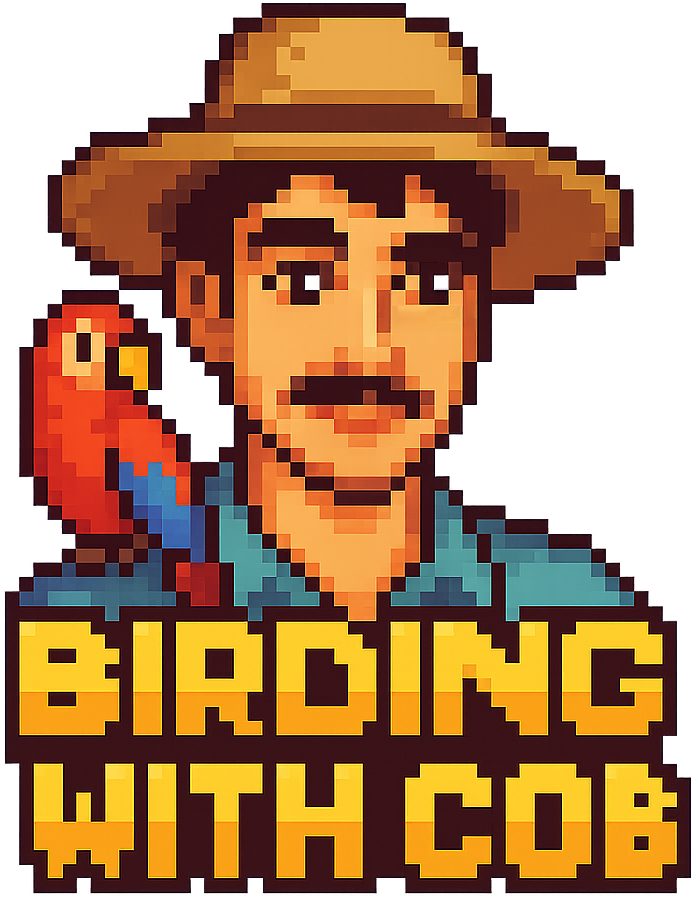

# 🐦 Birding with Cob

An interactive bird spotting application with a world map, species database, and photo sharing capabilities.



## ✨ Features

- 🗺️ **Interactive World Map** - Click anywhere to add bird spottings
- 🐦 **500+ Bird Species** - Powered by iNaturalist API with real bird data
- 📸 **Photo Upload** - Share photos of your bird sightings
- 🔍 **Location-Based Search** - Find birds specific to your area
- 📱 **Mobile Responsive** - Works perfectly on all devices
- 🎨 **Pokédex-Style UI** - Beautiful retro gaming aesthetic
- 🔐 **Admin Authentication** - Secure login for adding spottings
- 🌍 **Global CDN** - Fast loading worldwide

## 🚀 Live Demo

**Login Credentials:**
- Username: `admin`
- Password: `birdwatcher2025`

## 🛠️ Tech Stack

- **Frontend:** Next.js 15, React 19, TypeScript
- **Styling:** Tailwind CSS with custom Pokédex theme
- **Map:** Leaflet with OpenStreetMap
- **API:** iNaturalist for bird data
- **Storage:** Local file system for photos
- **Authentication:** Custom session-based auth
- **Deployment:** Vercel (recommended)

## 🏃‍♂️ Quick Start

### Prerequisites
- Node.js 18+
- npm or yarn

### Installation

1. **Clone the repository:**
```bash
git clone https://github.com/yourusername/birding-with-cob.git
cd birding-with-cob
```

2. **Install dependencies:**
```bash
npm install
```

3. **Run development server:**
```bash
npm run dev
```

4. **Open your browser:**
```
http://localhost:3000
```

## 📦 Available Scripts

- `npm run dev` - Start development server
- `npm run build` - Build for production
- `npm start` - Start production server
- `npm run lint` - Run ESLint

## 🌐 Deployment

### Deploy to Vercel (Recommended)

1. **Push to GitHub** (this repository)
2. **Connect to Vercel:**
   - Go to [vercel.com/new](https://vercel.com/new)
   - Import this repository
   - Click "Deploy"
3. **Done!** Your app is live

### Alternative Deployments

- **Railway:** Full Node.js support with $5 free credit
- **Render:** 750 hours/month free tier
- **Namecheap Shared Hosting:** See `NAMECHEAP-DEPLOYMENT-GUIDE.md`

## 🎮 How to Use

1. **Visit the app** in your browser
2. **Login** with admin credentials (see above)
3. **Click anywhere on the map** to add a bird spotting
4. **Select a bird species** from the location-based results
5. **Upload photos** and add notes about your sighting
6. **Submit** - your spotting appears on the map!

## 🔧 Configuration

### Environment Variables

Create a `.env.local` file for local development:

```env
NODE_ENV=development
NEXTAUTH_SECRET=your-secret-key-here
NEXTAUTH_URL=http://localhost:3000
```

### Authentication

Default login credentials can be changed in `src/app/page.tsx`:

```typescript
const validUsername = 'admin';
const validPassword = 'birdwatcher2025';
```

## 📁 Project Structure

```
birding-with-cob/
├── src/
│   ├── app/
│   │   ├── api/          # API routes
│   │   ├── globals.css   # Global styles
│   │   ├── layout.tsx    # Root layout
│   │   └── page.tsx      # Main application
│   └── components/       # React components
├── public/
│   └── uploads/          # Static assets and uploaded photos
├── README.md
├── package.json
└── next.config.js
```

## 🤝 Contributing

1. Fork the repository
2. Create a feature branch (`git checkout -b feature/amazing-feature`)
3. Commit your changes (`git commit -m 'Add amazing feature'`)
4. Push to the branch (`git push origin feature/amazing-feature`)
5. Open a Pull Request

## 📄 License

This project is open source and available under the [MIT License](LICENSE).

## 🙏 Acknowledgments

- **iNaturalist** for providing the comprehensive bird species API
- **OpenStreetMap** for map tiles
- **Leaflet** for the interactive mapping library
- **Next.js team** for the amazing framework

## 📞 Support

If you have any questions or need help:

1. Check the deployment guides in the repository
2. Open an issue on GitHub
3. Review the troubleshooting section in deployment guides

---

**Happy Birding! 🐦✨**
